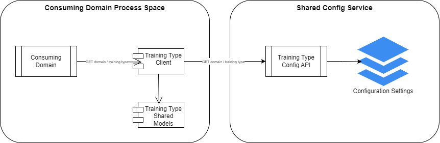

# Sample shared config implementation
Provides a basic (not production strength) shared configuration service implementation to demonstrate the concept of providing centralised configuration to different domains within a microservices architecture.  Further, within a domain, it allows configuration to be segmented on a different aspect - for example, training type.  Imagine a scenario, where behaviour within a domain differed by training type, we would want to be able to load the settings for a given domain (payments, contract management, recruitment as so forth) for each training type (e.g. Apprenticeships, HTQs, Essential Skills).  This would allow domain behaviour to be dynamically driven based on the training type of the recored it were processing.  Imagine a scenario where the contracting domain had to enforce a different contract duration based upon the training type, or where the recruit domain needed to hide a particular feature for a specific training type.  Using this approach, the domains behaviour is controlled by the settings, allowing new training types to be added via configuration only (with no need for new code, if they used the existing behaviours)

Context diagram shown below.

## Training Type Config API
Stores the configuration for each combination of Domain and Training type.  Allows this to be access via an API endpoint.  A http file is included for endpoint testing, ensure you install the *Rest Client* extension is using Visual Studio Code.

## Training Type Shared Models
Assembly storing the c# models for each configuration set.

## Training Type Config Client
API client used by domain processes to simplify access to the config API.

## Consuming Domain
Represents a sample domain consuming the config service